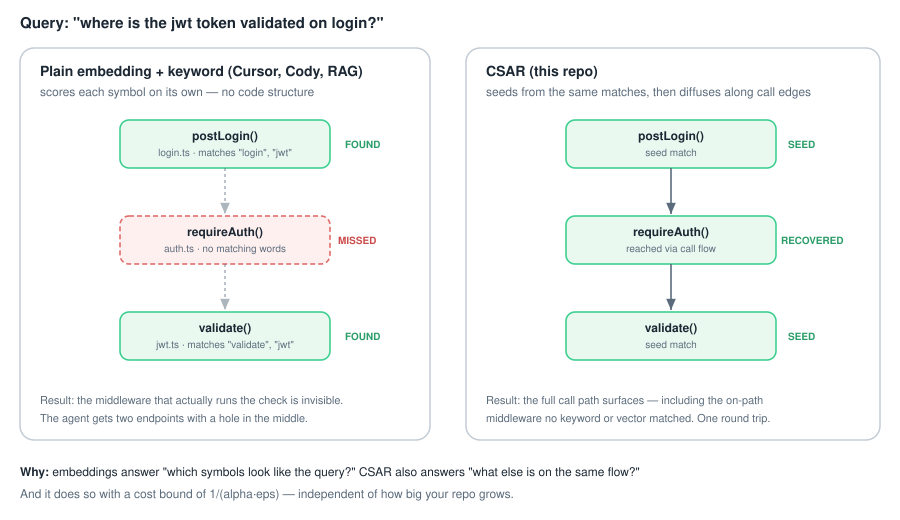
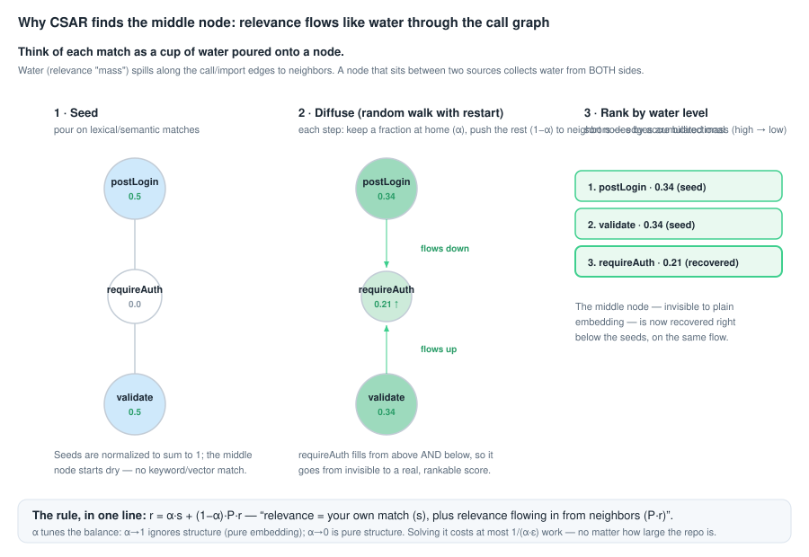
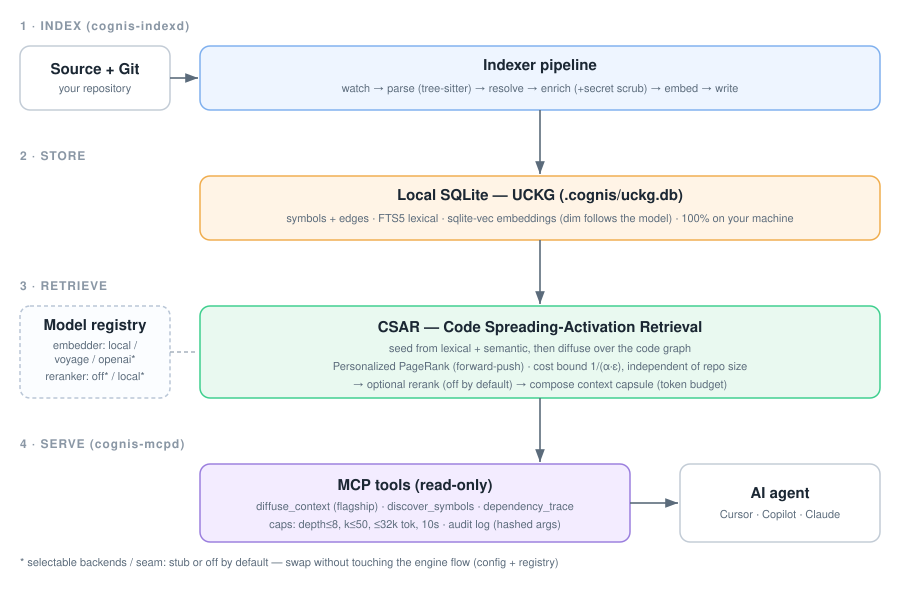

<div align="center">


# cognis

</div>

> **Software Cognition Engine** for MCP clients and coding agents.
>
> **Status: v0.6.0** — see [CHANGELOG.md](CHANGELOG.md).

`cognis` is a **local, private** code-retrieval engine. It indexes your
repository on your machine and exposes precise retrieval tools (symbol lookup,
semantic search, dependency tracing, task-focused context) to any
MCP-compatible AI agent — Cursor, Copilot, Claude, and more.

## The problem it solves

Ask an AI assistant *"where is the JWT token validated on login?"* Tools that
rank code by **embedding similarity + keyword (BM25)** score every symbol on its
own. They find the two ends that mention "login" and "validate" — but the
**middleware that actually runs the check in between** matches no query words, so
it never surfaces. The agent gets a flow with a hole in the middle and guesses.



cognis is built on **CSAR — Code Spreading-Activation Retrieval**. It starts from
the *same* cheap lexical + semantic matches, then **diffuses relevance along the
call graph** (`calls` / `imports` edges) using Personalized PageRank. The on-path
middleware surfaces because it sits between two relevant symbols — recovered in a
single round trip, even with zero direct match.

### Why it works

Treat relevance like **water poured onto the matched nodes** and let it flow
along the call edges. A node *between* two matches collects water from both sides
— so it ends up relevant even though it matched no query words.



1. **Seed** — pour relevance onto the lexical/semantic matches.
2. **Diffuse** — each step keeps a fraction `α` of a node's mass and pushes the
   rest `(1−α)` to neighbors. The middle node fills from both sides.
3. **Rank** — sort by accumulated mass; the on-path node rises next to the seeds.

One fixed-point equation captures it:

```
r = α·s + (1−α)·P·r        relevance = your own match (s) + relevance flowing in from neighbors (P·r)
```

`α` is the only knob (`α→1` = plain embedding, `α→0` = pure structure), and the
solver's work is bounded by `1/(α·ε)` — **independent of repo size**. Full math
and proofs: [docs/csar.md](docs/csar.md).

### How it compares

| | Embedding / vector KNN | Keyword (BM25) | **CSAR (this repo)** |
| --- | --- | --- | --- |
| Scores | meaning of each symbol | words in each symbol | meaning + **code structure** |
| Uses call/import edges | ✗ | ✗ | ✓ |
| Finds on-path code with no match | ✗ | ✗ | ✓ |
| Cost as repo grows | grows with `k` | grows with `k` | **capped at `1/(α·ε)`** |

CSAR does **not** replace embeddings — it *uses* them (plus keyword hits) as the
seed, then adds the structural signal they're blind to.

> **Scope.** CSAR's diffusion is a real, math-proven mechanism (solver
> work bounded by `1/(α·ε)`; degree-free lift — see [docs/csar.md](docs/csar.md))
> and it genuinely surfaces on-path code that pure similarity misses. Whether it
> yields *higher overall retrieval quality* than a strong hybrid baseline (BM25 +
> dense, reciprocal-rank-fused) is under active benchmarking on objective,
> bug-fix-derived ground truth. cognis does **not** claim to beat embedding
> search in general — read the table above as *mechanism* differences, not a
> proven quality ranking.

## How it works (architecture)



Everything runs on your machine in four stages:

1. **Index** (`cognis-indexd`) — watch → tree-sitter parse → resolve edges →
   enrich (**+ scrub secrets before persisting**) → embed locally → write.
2. **Store** — one local SQLite **Unified Code Knowledge Graph** (`.cognis/uckg.db`):
   symbols + edges, FTS5 lexical index, `sqlite-vec` embeddings. No code leaves
   your computer.
3. **Retrieve** (CSAR) — diffuse over the graph as described above.
4. **Serve** (`cognis-mcpd`) — read-only MCP tools (flagship: `diffuse_context`)
   with hard caps on depth, k, tokens, wall time, and concurrency, plus a
   hashed-argument audit log.

### Swapping models

The embedding and reranking models sit behind small protocols and a registry,
so you can plug a different model in without touching the retrieval/capsule
flow. A backend is selected by `.cognis/config.yaml` (`embedder.backend`,
`reranker.backend`) and resolved through one factory used by every entry point
(daemon, MCP server, CLI, eval) — there is no per-call-site `if backend == …`
to keep in sync.

- **Embedders.** `local` (sentence-transformers, e.g. `bge-small-en-v1.5`) is
  the production default. `voyage` and `openai` are opt-in stubs: selectable and
  schema-compatible, but they return zero vectors until the API call is wired
  in. Adding your own is one class plus a one-line `@register_embedder`.
- **Vector dimension follows the model.** `LocalEmbedder` reports its real
  dimension and the store reconciles to it — swapping to a different-sized model
  recreates the `symbol_vec` table at the new width and re-embeds on the next
  index pass. No constant to edit.
- **Reranking is an opt-in seam.** Disabled by default, in which case a
  pass-through reranker leaves ranking byte-for-byte unchanged. Enable
  `reranker.enabled` to route fused candidates through a cross-encoder
  (`bge-reranker-v2-m3`); the scoring model itself is a stub today.

See [docs/architecture.md](docs/architecture.md) for the registry contract.

### Independent audit

The math and security were reviewed against the actual code and tests
(`packages/retrieval/.../csar.py`, `tests/unit/test_csar.py`, `tests/pbt/`).

| Dimension | Rating | Basis |
| --- | --- | --- |
| Retrieval quality | 8 / 10 | recovers on-path flow; reuses cheap seed signals |
| Mathematical rigor | 9 / 10 | 5 PPR theorems, verified in code & property tests |
| Security posture | 8 / 10 | secret scrubbing, read-only tools, hard caps, hashed audit log |
| Scope / maturity | 7 / 10 | 3 languages (TS/JS, Py, Go); local-first |

All five CSAR theorems are verified in code/tests; both `α` endpoints included.
Security uses only standard hashing (SHA-256) — **no custom cryptography**.
Threat model: [docs/security.md](docs/security.md).

## Install

**One-click prebuilt build (recommended).** Install the `.vsix`, open the Cognis
panel, click **Install backend**, then **Set Up for AI**. No terminal, no Python
setup. Buy it and you're running in two minutes; follow the `INSTALL.md` in your
download.

**From source (for experts).** Requires Python ≥ 3.11 and Git.

```bash
git clone https://github.com/buimanhtoan-it/cognis && cd cognis
python -m venv .venv
# activate: source .venv/bin/activate   (Windows: .\.venv\Scripts\Activate.ps1)
python -m pip install -e ".[indexer,embed-local,vector,tokenizers,mcp]"
```

Then either use the editor extension (`python scripts/setup_extension.py
--package`, install the `.vsix`, run **Cognis: Set Up for AI**) or the CLI:

```bash
cognis-cli bootstrap .   # init + index + health
cognis-mcpd              # start the MCP server (stdio)
```

Point any MCP client at `cognis-mcpd` (see
[docs/mcp-client-config.md](docs/mcp-client-config.md)). Re-index from scratch
with `cognis-cli index --clear .`.

> Module form if not on `PATH`: `python -m cognis.cli.main bootstrap .` and
> `python -m cognis_mcpd.main`.

See [docs/getting-started.md](docs/getting-started.md) and
[docs/install.md](docs/install.md) for fresh-machine and `sqlite-vec` details.

## Self-hosted (Docker)

```bash
export WORKSPACE_HOST_PATH=/path/to/your/codebase
docker compose -f deploy/compose.yaml up -d
```

See [docs/operations.md](docs/operations.md).

## Current scope

| Area | Status |
| --- | --- |
| Indexer (TS / Python / Go) | Implemented |
| **CSAR diffusion retrieval** | **Implemented — primary engine** |
| Retrieval (lexical, semantic, structural) | Implemented (CSAR seed/fallback) |
| MCP server (8 tools, stdio) | Implemented |
| VS Code / Cursor extension | Implemented (`apps/cognis-vscode`) |
| Embedder registry + local backend | Implemented; `voyage`/`openai` are selectable stubs |
| Model-driven vector dimension | Implemented (store reconciles to the model) |
| Reranker seam | Wired; default off (pass-through), cross-encoder backend is a stub |
| LSP resolver | Detection only; heuristic fallback for edges |
| PyPI publish | Not yet — install from source |

## Development

| Command | Runs |
| --- | --- |
| `make lint` | `ruff format --check` + `ruff check` |
| `make typecheck` | `mypy` (strict on `packages/core`) |
| `make test` | `pytest` unit + property tests |
| `make eval` | golden-set runner |

`tasks.py` exposes the same recipes where `make` is unavailable (`invoke lint
typecheck test`).

## License

The **engine** (this repo) is Apache-2.0 — see [`LICENSE`](LICENSE). The
**prebuilt VS Code / Cursor build** is a separate commercial product — see
[`apps/cognis-vscode/LICENSE.txt`](apps/cognis-vscode/LICENSE.txt).

## Links

- CSAR math + proofs: [docs/csar.md](docs/csar.md)
- Architecture: [docs/architecture.md](docs/architecture.md)
- Security: [docs/security.md](docs/security.md)
- MCP client setup: [docs/mcp-client-config.md](docs/mcp-client-config.md)
- Changelog: [CHANGELOG.md](CHANGELOG.md)
